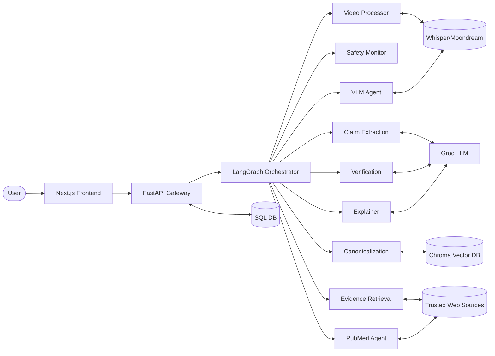
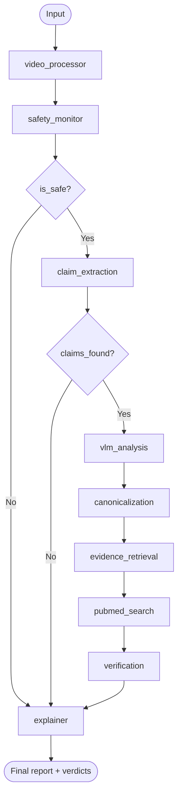

# ArogyaSatya

Agentic AI platform for healthcare misinformation detection, verification, and explainable reporting across text, images, and video transcripts.

## Overview

ArogyaSatya uses a coordinated multi-agent workflow (LangGraph) to transform raw content into claim-level verdicts backed by evidence.  
The system is designed for high-trust use cases: safety-gated execution, retrieval grounding, canonical claim memory, and transparent explanations.

## Key Features

- Multi-agent orchestration (`LangGraph`) with conditional control flow
- Multimodal analysis (text, image, video transcript)
- Evidence retrieval from trusted sources + PubMed augmentation
- Canonical claim deduplication with vector memory (`ChromaDB`)
- Trend clustering for recurring misinformation narratives
- Dashboard-first UX with operational status and quick analysis actions

## Why Agentic (vs Single LLM)

| Dimension | Single LLM Call | ArogyaSatya Agentic Pipeline |
|---|---|---|
| Reasoning structure | Opaque, monolithic | Explicit state graph with specialized agents |
| Safety handling | Prompt-dependent | Dedicated safety gate with controlled short-circuit |
| Grounding | Often weak/citation-light | Retrieval + PubMed + evidence fusion |
| Repeatability | Variable | Deterministic flow and node contracts |
| Memory | Session-local | SQL + vector memory for continuity |
| Explainability | Generic summary | Claim-level verdicts with rationale |

## System Architecture



## Execution Flow



For full research-style diagrams:
- [docs/ARCHITECTURE.md](docs/ARCHITECTURE.md)
- [diagrams/arogyasatya-phd-flow-diagram.mmd](diagrams/arogyasatya-phd-flow-diagram.mmd)
- [diagrams/arogyasatya-phd-system-flowchart.mmd](diagrams/arogyasatya-phd-system-flowchart.mmd)

## Tech Stack

- Frontend: Next.js, TypeScript, Tailwind
- Backend: FastAPI, SQLAlchemy (async)
- Orchestration: LangGraph, LangChain
- Data: SQLite/PostgreSQL, ChromaDB
- Models: Groq LLM + local Whisper/VLM components

## Repository Structure

- `app/agents/` agent nodes and graph orchestration
- `app/api/` API endpoints
- `app/core/` config, caching, trends, cleanup
- `app/db/` models and database setup
- `app/scrapers/` ingestion connectors
- `app/dashboard/` dashboard page
- `components/` reusable frontend UI
- `docs/` blueprint and architecture docs
- `diagrams/` editable Mermaid/Draw.io diagrams
- `submissions/` prework and presentation assets

## Run Locally

### Prerequisites

- Python 3.10+
- Node.js 18+
- `ffmpeg` (recommended for video transcription path)

### 1) Backend

```bash
python -m venv .venv
.venv\Scripts\activate
pip install -r requirements.txt
copy .env.example .env
```

Set `GROQ_API_KEY` in `.env`, then run:

```bash
python -m uvicorn app.main:app --host 127.0.0.1 --port 9000
```

Health check:

```bash
http://127.0.0.1:9000/api/health
```

### 2) Frontend

```bash
npm install --legacy-peer-deps
```

PowerShell (point frontend to backend):

```powershell
$env:NEXT_PUBLIC_API_BASE_URL="http://127.0.0.1:9000"
npm run dev
```

Open:
- Frontend: `http://127.0.0.1:3000`
- Dashboard: `http://127.0.0.1:3000/dashboard`

## API Reference

- `GET /api/health` service health
- `POST /api/trigger-scan` run source ingestion
- `GET /api/articles` list latest ingested content
- `POST /api/analyze/{id}` analyze stored article/content
- `POST /api/analyze-text` analyze raw text payload
- `GET /api/trends` return trend clusters

## Configuration

Use [`.env.example`](.env.example) as base.

- `DATABASE_URL` SQL DB connection (default local SQLite)
- `GROQ_API_KEY` LLM key
- `FRONTEND_ORIGINS` comma-separated CORS origins
- `ENABLE_SQL_ECHO` SQL debug logs (`true/false`)

## Professional Notes

- Runtime DB files are local artifacts and should not be treated as source of truth.
- Diagram sources are editable and versioned under `diagrams/`.
- Submission materials are under `submissions/ai-learning-labs-round1/`.

## Troubleshooting

- If icon/dashboard requests fail after branch switches, restart frontend and clear stale build output:
  - stop dev server
  - delete `.next/`
  - run `npm run dev` again
- If backend port is blocked on Windows, switch to another free port (for example `9000`).

## License

MIT
