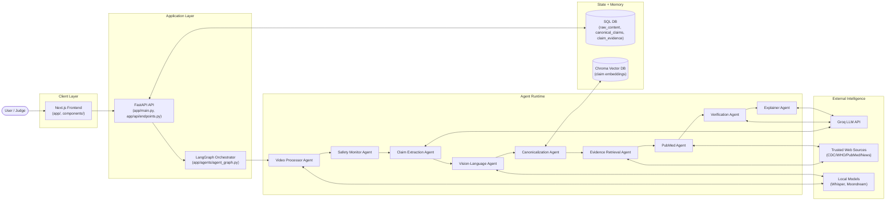
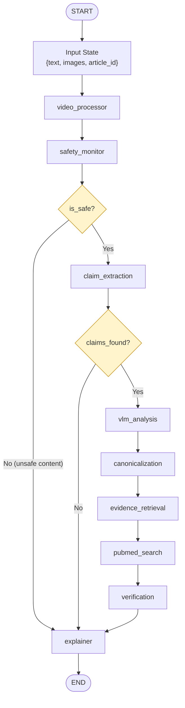
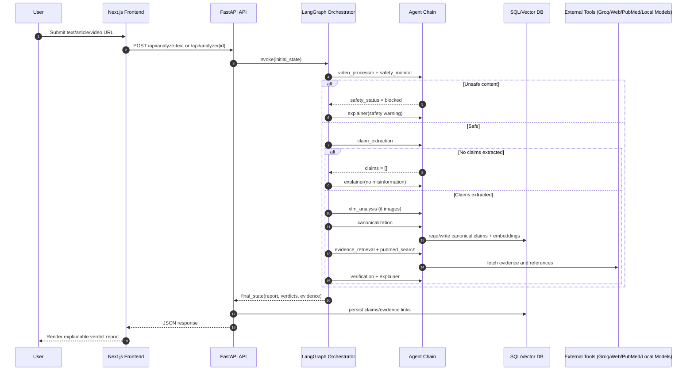

# ArogyaSatya Architecture

## 1) System Context (Deployment + Integrations)

## 2) Agent Orchestration Graph (LangGraph Runtime)

## 3) End-to-End Request Sequence

## 4) Data Model

- `raw_content`: ingested input (text/media metadata/transcripts)
- `canonical_claims`: normalized claim memory and evolving verdict status
- `claim_evidence`: evidence snippets + support/refute polarity
- `claim_content_association`: many-to-many mapping between content and claims

## 5) Why This Is Agentic

- Explicit planner/executor graph (LangGraph), not single-shot prompting.
- Specialized role-based agents with distinct tools and outputs.
- Conditional control flow (`safety gate`, `no-claim shortcut`) for dynamic behavior.
- Shared memory through SQL + vector DB for retrieval and claim continuity.
- Multi-step reasoning with evidence collection before verdict generation.
