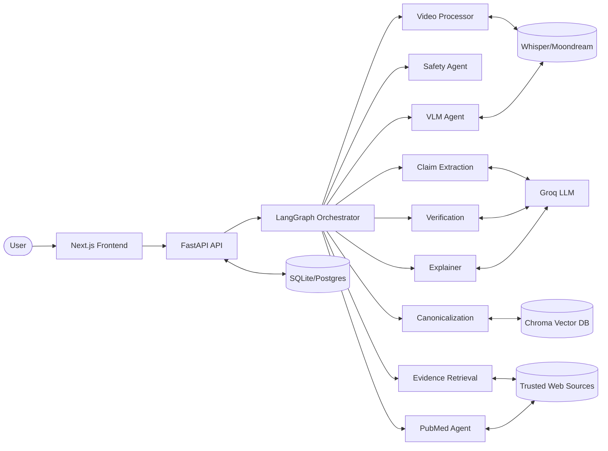

# AI Learning Labs Round 1 Prework

## Candidate Project
**Project:** ArogyaSatya - Agentic AI Healthcare Misinformation Verification Engine  
**Repo:** (add your GitHub link here)  
**Live Demo:** (add deployed URL if available)  
**Additional Notes/Blog:** (add writeup/blog link if available)

---

## Section 1: Context (Brief)

### One-paragraph description
ArogyaSatya is an agentic AI system that detects and verifies healthcare misinformation from text, images, and video transcripts. Instead of relying on one monolithic LLM call, it orchestrates specialized agents (safety, claim extraction, visual analysis, canonicalization, evidence retrieval, biomedical lookup, verification, and explanation) through a LangGraph state machine. The system outputs claim-level verdicts with evidence and explanations, while persisting canonical claims and sources in SQL + vector memory for continuity across analyses.

### Primary technical constraints
- Needed deterministic, explainable multi-step behavior (not black-box single prompt output).
- Had to support multimodal input under hackathon-time constraints.
- Required low-latency responses while still grounding answers in external evidence.
- Needed simple local setup (SQLite + local model options) with easy path to production deployment.

---

## Section 2: Technical Implementation (Detailed)

### Architecture diagram + 2-sentence explanation


The frontend calls FastAPI, which invokes a LangGraph orchestration pipeline of specialized agents. Each agent contributes a typed state update, and the final report is returned with grounded claim verdicts while persistent data is saved in SQL/vector stores.

### Code walk-through of one critical function
**Function:** `check_safety` + conditional routing in [`app/agents/agent_graph.py`](../../app/agents/agent_graph.py)

This function is critical because it enforces early safety gating before costly and potentially harmful downstream processing.

```python
def check_safety(state):
    safety = state.get("safety_status", {})
    if safety and not safety.get("is_safe", True):
        return "explainer"
    return "claim_extraction"
```

Why it matters:
- It prevents unsafe content from entering extraction/retrieval/verification branches.
- It creates dynamic execution paths, which is a core agentic behavior (context-aware control flow).

### Data flow for one key operation
**Operation:** `POST /api/analyze/{id}` (analyzing ingested content)

1. API reads `RawContent` row from SQL by `content_id`.
2. API assembles initial agent state (`text`, `images`, claim/evidence placeholders).
3. LangGraph executes: video processing -> safety check -> claim extraction -> retrieval/verification pipeline.
4. Graph returns `final_state` containing `verification_results` + `final_report`.
5. API persists canonical claims/evidence links into SQL (`canonical_claims`, `claim_evidence`).
6. API returns structured JSON to frontend for report rendering.

---

## Section 3: Technical Decisions (Core)

### Two most significant technology choices with trade-offs
1. **LangGraph for orchestration instead of prompt chaining**
   - Why chosen: explicit state transitions, conditional edges, and debuggable agent boundaries.
   - Trade-off: more architecture overhead and state-schema discipline versus simple linear prompt flow.

2. **Hybrid memory model (SQL + Chroma vector DB)**
   - Why chosen: SQL provides strong metadata/history; vector store enables semantic claim deduplication and retrieval.
   - Trade-off: dual-store consistency complexity and extra operational footprint.

### One scaling bottleneck and mitigation strategy
**Bottleneck:** long-running multimodal inference (video transcription + external evidence retrieval) can increase p95 latency significantly.  
**Mitigation:** move long operations to async job workers (queue-based execution), return a job ID immediately, and stream incremental status/results; cache canonical claims + retrieval outputs to avoid repeated expensive calls.

---

## Section 4: Learning & Iteration (Concise)

### One technical mistake and what you learned
Initially, I treated claim canonicalization too simplistically (string-level matching), which produced duplicate narratives and noisy trend clusters. I learned that semantic normalization must be designed as a first-class capability early, not a post-processing patch.

### One thing you'd do differently today
I would introduce observability from day one: per-agent latency/token metrics, structured logs, and quality counters (grounding rate, unsupported-claim rate) so model/pipeline regressions are caught immediately.

---

## Optional Supporting Links To Add Before Submission
- GitHub repository
- Live demo link
- Architecture doc: `docs/ARCHITECTURE.md`
- Agentic blueprint: `docs/AGENTIC_BLUEPRINT.md`
- Short build log/blog (if available)
